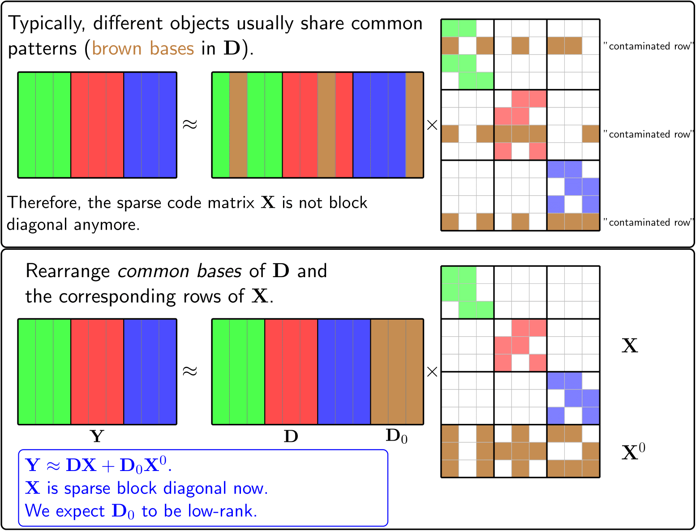
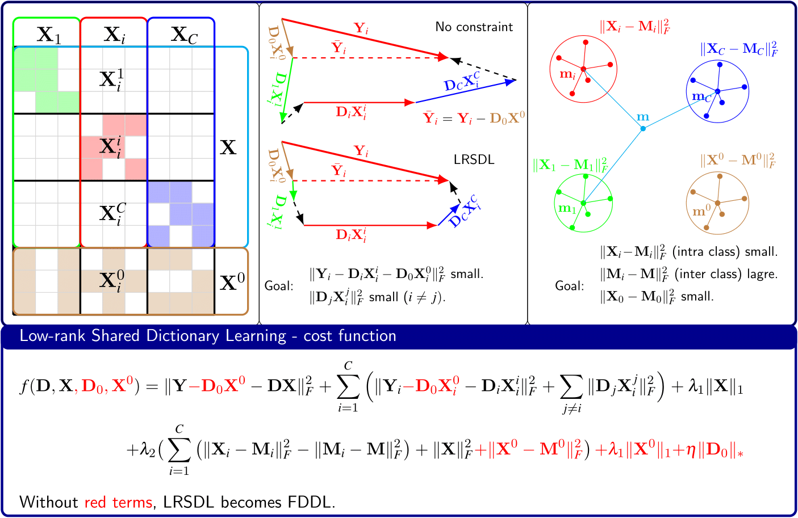

# Discriminative dictionary Learning Toolbox for Classification.
_This repository is under construction_

<!-- MarkdownTOC -->

- [Notation](#notation)
- [Sparse Representation-based classification \(SRC\)](#sparse-representation-based-classification-src)
- [Online Dictionary Learning \(ODL\)](#online-dictionary-learning-odl)
  - [Cost function](#cost-function)
  - [Training ODL](#training-odl)
- [LCKSVD](#lcksvd)
- [Dictionary learning with structured incoherence and shared features \(DLSI\)](#dictionary-learning-with-structured-incoherence-and-shared-features-dlsi)
  - [Cost function](#cost-function-1)
  - [Training DLSI](#training-dlsi)
  - [DLSI predict new sample](#dlsi-predict-new-sample)
  - [Demo](#demo)
- [Dictionary learning for separating the particularity and the commonality \(COPAR\)](#dictionary-learning-for-separating-the-particularity-and-the-commonality-copar)
  - [Cost function](#cost-function-2)
  - [Training COPAR](#training-copar)
  - [COPAR predect new samples](#copar-predect-new-samples)
  - [Demo](#demo-1)
- [LRSDL](#lrsdl)
  - [Motivation](#motivation)
  - [Cost function](#cost-function-3)
  - [Traing LRSDL](#traing-lrsdl)
  - [LRSDL predict new samples](#lrsdl-predict-new-samples)
  - [Demo](#demo-2)
- [Fisher discrimination dictionary learning \(FDDL\)](#fisher-discrimination-dictionary-learning-fddl)
  - [Cost function](#cost-function-4)
  - [Training FDDL](#training-fddl)
  - [FDDL predect new samples](#fddl-predect-new-samples)
- [Discriminative Feature-Oriented dictionary learning \(DFDL\)](#discriminative-feature-oriented-dictionary-learning-dfdl)
- [D2L2R2](#d2l2r2)
- [Fast iterative shrinkage-thresholding algorithm](#fast-iterative-shrinkage-thresholding-algorithm)
- [References](#references)

<!-- /MarkdownTOC -->

# Notation
* `Y`: signals.
* `D`: dictionary.
* `X`: sparse coefficient.
* `d`: signal dimension. `d = size(Y, 1)`.
* `C`: number of classes.
* `c`: class index.
* `n_c`: number of training samples in class `c`. Typically, all `n_c` are the same and equal to `n`.
* `N`: total number of training samples.
* `Y_range`: an array storing range of each class, suppose that labels are sorted in a ascending order. 
  Example: If `Y_range = [0, 10, 25]`, then:
     - There are two classes, samples from class 1 range from 1 to 10, from class 2 range from 11 to 25. 
     - In general, samples from class `c` range from `Y_range(c) + 1` to `Y_range(c+1)`
     - We can observe that number of classes `C = numel(Y_range) - 1`.
* `k_c`: number of bases in class-specific dictionary `c`. Typically, all `n_c` are the same and equal to `k`.
* `k_0`: number of bases in the shared-dictionary 
* `K`: total number of dictionary bases. 
* `D_range`: similar to `Y_range` but used for dictionary without the shared dictionary. 

# Sparse Representation-based classification (SRC)
* Sparse Representation-based classification implementation [[1]](#fn_src).
* Classification based on SRC.
* Syntax: `[pred, X] = SRC_pred(Y, D, D_range, opts)`
  - INPUT:
    + `Y`: test samples.
    + `D`: the total dictionary. `D = [D_1, D_2, ..., D_C]` with `D_c` being the _c-th_ class-specific dictionary.
    + `D_range`: range of class-specific dictionaries in `D`. See also [Notation](#notation).
    + `opts`: options.
      * `opts.lambda`: `lambda` for the Lasso problem. Default: `0.01`.
      * `opts.max_iter`: maximum iterations of fista algorithm. Default:  `100`. [Check this simple implementation of FISTA](https://github.com/tiepvupsu/FISTA) 
  - OUTPUT:
    + `pred`: predicted labels of test samples.
    + `X`: solution of the lasso problem.

# Online Dictionary Learning (ODL)
* An implementation of the well-known Online Dictionary Learning method [[2]](#fn_odl).

## Cost function 

    

## Training ODL 
* Syntax: `[D, X] = ODL(Y, k, lambda, opts, sc_method)`
  - INPUT: 
    + `Y`: collection of samples.
    + `k`: number of bases in the desired dictionary.
    + `lambda`: norm 1 regularization parameter.
    + `opts`: option.
    + `sc_method`: sparse coding method used in the sparse coefficient update. Possible values:
      - `'fista'`: using FISTA algorithm. See also [`fista`](#fista).
      - `'spams'`: using SPAMS toolbox [[12]](#fn_spams). 
  - OUTPUT:
    + `D, X`: as in the problem.

# LCKSVD

Check its [project page](http://www.umiacs.umd.edu/~zhuolin/projectlcksvd.html)
# Dictionary learning with structured incoherence and shared features (DLSI)
* An implementation of the well-known DLSI method [[5]](#fn_dls).

## Cost function

## Training DLSI 
* function `[D, X, rt] = DLSI(Y, Y_range, opts)`
* The main DLSI algorithm 
* INPUT: 
  - `Y, Y_range`: training samples and their labels 
  - `opts`: 
    + `opts.lambda, opts.eta`: `lambda` and `eta` in the cost function 
    + `opts.max_iter`: maximum iterations. 
* OUTPUT:
  - `D`: the trained dictionary, 
  - `X`: the trained sparse coefficient,
  - `rt`: total running time of the training process.   

## DLSI predict new sample 
* function `pred = DLSI_pred(Y, D, opts)`
* predict the label of new input `Y` given the trained dictionary `D` and 
parameters stored in `opts` 

## Demo 
Run `DLSI_top` in Matlab command window.

# Dictionary learning for separating the particularity and the commonality (COPAR)

* An implementation of COPAR [[7]](#fn_cor).

## Cost function 

## Training COPAR 

* function `[D, X, rt] = COPAR(Y, Y_range, opts)`

* INPUT:
  - `Y, Y_range`: training samples and their labels 
  - `opts`: a struct 
    + `opts.lambda, opts.eta`: `lambda` and `eta` in the cost function 
    + `opts.max_iter`: maximum iterations. 

* OUTPUT:
  - `D`: the trained dictionary, 
  - `X`: the trained sparse coefficient,
  - `rt`: total running time of the training process.   

## COPAR predect new samples 

* function pred = COPAR_pred(Y, D, D_range_ext, opts)
* predict label of the input Y
* INPUT:
  -  `Y`: test samples 
  -  `D`: the trained dictionary 
  -  `D_range_ext`: range of class-specific and shared dictionaries in `D`. The shared dictionary is located at the end of `D`.
  -  `opts`: a struct of options:
    +  `opts.classify_mode`: a string of classification mode. either `'GC'` (global coding) or `'LC'` (local coding)
    +  `opts.lambda, opts.eta, opts.max_iter`: as in `COPAR.m`.

* OUTPUT:
  - `pred`: predicted labels of `Y`.

## Demo
Run `COPAR_top` in the Matlab command window.

# LRSDL

* An implementation of COPAR [[8]](#fn_cor).

## Motivation 

## Cost function 

__Note that unlike COPAR, in LSRDL, we separate the class-specific dictionaries (`D`) and the shared dictionary (`D_0`). The sparse coefficients (`X`, `X^0`) are also separated.__

## Traing LRSDL 
* function `[D, D0, X, X0, CoefM, coefM0, opts, rt] = LRSDL(Y, train_label, opts)
* INPUT:
  - `Y, Y_range`: training samples and their labels 
  - `opts`: a struct 
    + `opts.lambda1, opts.lambda`: `lambda1` and `lambda2` in the cost function, 
    + `opts.lambda3`: `eta` in the cost function (fix later),
    + `opts.max_iter`: maximum iterations,
    + `opts.D_range`: range of the trained dictionary,
    + `opts.k0`: size of the shared dictionary 

* OUTPUT:
  - `D, D0, X, X0`: trained matrices as in the cost function,
  - `CoefM`: the mean matrix. `CoefM(:, c)` is the mean vector of `X_c` (mean of columns).
  - `CoefM0`: the mean vector of `X0`,
  - `rt`: total running time (in seconds).

## LRSDL predict new samples

See `LRSDL_pred_GC.m` function

## Demo 
Run `LRSDL_top` in the Matlab command window.

# Fisher discrimination dictionary learning (FDDL)
* An implementation of FDDL [[4]](#fn_fdd).

## Cost function 

Simiar to LRSDL cost function without red terms.

## Training FDDL 
Set `opts.k0 = 0` and using `LRSDL.m` function.

## FDDL predect new samples

* function `pred = FDDL_pred(Y, D, CoefM, opts)``

# Discriminative Feature-Oriented dictionary learning (DFDL)
* Its [project page](https://github.com/tiepvupsu/dfdl).

# D2L2R2 
* Update later 

# Fast iterative shrinkage-thresholding algorithm
* An implementation of FISTA [[10]](#fn_cor).
* Check [this repository](https://github.com/tiepvupsu/fista)

# References

<a name="fn_src">[1]</a>. (**SRC**)Wright, John, et al. "Robust face recognition via sparse representation." _Pattern Analysis and Machine Intelligence, IEEE Transactions on_ 31.2 (2009): 210-227. [paper](http://www.columbia.edu/~jw2966/papers/WYGSM09-PAMI.pdf )

<a name="fn_odl">[2]</a>. (**ODL**) Mairal, Julien, et al. "Online learning for matrix factorization and sparse coding." _The Journal of Machine Learning Research 11_ (2010): 19-60. [[paper]](http://www.di.ens.fr/~fbach/mairal10a.pdf)

<a name="fn_lck">[3]</a>. (**LC-KSVD**) Jiang, Zhuolin, Zhe Lin, and Larry S. Davis. "Label consistent K-SVD: Learning a discriminative dictionary for recognition." _Pattern Analysis and Machine Intelligence, IEEE Transactions on_ 35.11 (2013): 2651-2664. [[Project page]](http://www.umiacs.umd.edu/~zhuolin/projectlcksvd.html)

<a name="fn_fdd">[4]</a>. (**FDDL**) Yang, Meng, et al. "Fisher discrimination dictionary learning for sparse representation." _Computer Vision (ICCV), 2011 IEEE International Conference on. IEEE_, 2011. [[paper]](http://www4.comp.polyu.edu.hk/~cslzhang/paper/conf/iccv11/FDDL_ICCV_final.pdf), [[code]](http://www4.comp.polyu.edu.hk/~cslzhang/code/FDDL.zip)

<a name="fn_dls">[5]</a>. (**DLSI**)Ramirez, Ignacio, Pablo Sprechmann, and Guillermo Sapiro. "Classification and clustering via dictionary learning with structured incoherence and shared features." _Computer Vision and Pattern Recognition (CVPR), 2010 IEEE Conference on. IEEE_, 2010. [[paper]](http://ieeexplore.ieee.org/xpls/abs_all.jsp?arnumber=5539964&tag=1)

<a name="fn_dfd">[6]</a>. (**DFDL**) Discriminative Feature-Oriented dictionary Learning.
 Tiep H. Vu, H. S. Mousavi, V. Monga, A. U. Rao and G. Rao, "Histopathological Image Classification using Discriminative Feature-Oriented dictionary Learning", _IEEE Transactions on Medical Imaging_ , volume 35, issue 3, pages 738-751, March 2016. [[paper]](http://arxiv.org/pdf/1506.05032v5.pdf) [[Project page]](http://signal.ee.psu.edu/dfdl.html)

<a name="fn_cor">[7]</a>. (**COPAR**) Kong, Shu, and Donghui Wang. "A dictionary learning approach for classification: separating the particularity and the commonality." _Computer Vision ECCV_ 2012. Springer Berlin Heidelberg, 2012. 186-199. [[paper]] (http://www.cs.zju.edu.cn/people/wangdh/papers/draft_ECCV12_particularity.pdf)

<a name="fn_lrs">[8]</a>. (**LRSDL**) Tiep H. Vu, Vishal Monga. "Learning a low-rank shared dictionary for object classification." Submitted to International Conference on Image Processing (ICIP) 2016. [[paper]](http://arxiv.org/abs/1602.00310)

<a name="fn_shr">[9]</a>. A singular value thresholding algorithm for matrix completion." _SIAM Journal on Optimization_ 20.4 (2010): 1956-1982. [[paper]](http://arxiv.org/pdf/0810.3286v1.pdf)

<a name="fn_fista">[10]</a>. (**FISTA**) Beck, Amir, and Marc Teboulle. "A fast iterative shrinkage-thresholding algorithm for linear inverse problems." _SIAM journal on imaging sciences_ 2.1 (2009): 183-202. [[paper]](http://people.rennes.inria.fr/Cedric.Herzet/Cedric.Herzet/Sparse_Seminar/Entrees/2012/11/12_A_Fast_Iterative_Shrinkage-Thresholding_Algorithmfor_Linear_Inverse_Problems_(A._Beck,_M._Teboulle)_files/Breck_2009.pdf)

<a name="fn_spams"> [11]</a>. (**SPAMS**) [The Sparse Modeling Software](http://spams-devel.gforge.inria.fr/)
